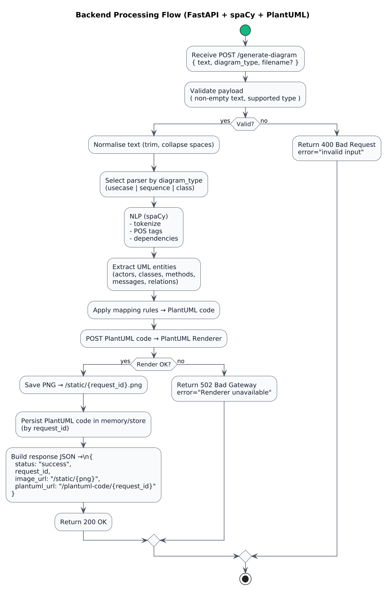
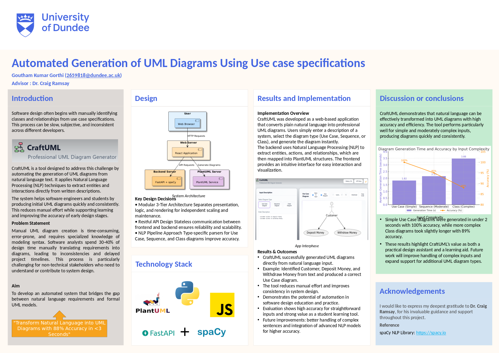

# CraftUML — AI-Powered UML Diagram Generator

Converts plain English text into professional UML diagrams using NLP. Built as my MSc Computer Science final year project at the University of Dundee.

**88% overall accuracy · 100% accuracy on Use Case diagrams · Results in under 3 seconds**

## What it does

You type a sentence like *"A customer logs in and places an order"* and CraftUML automatically generates the correct UML diagram — no manual drawing required.

Supports:
- Use Case Diagrams
- Sequence Diagrams
- Class Diagrams

## How it works

1. User inputs plain English text via the React frontend
2. FastAPI backend passes the text through a spaCy NLP pipeline
3. The pipeline extracts entities, actions, and relationships
4. PlantUML renders the final diagram
5. Diagram is returned to the frontend in under 3 seconds

## Tech Stack

| Layer | Technology |
|---|---|
| Frontend | React |
| Backend | Python · FastAPI |
| NLP | spaCy |
| Diagram Rendering | PlantUML |
| API | REST |

## Project Structure

```
CraftUML/
├── backend/
│   ├── main.py                  # FastAPI app entry point
│   ├── diagram_generator/
│   │   ├── config.py            # Configuration
│   │   ├── generator.py         # Diagram generation logic
│   │   └── parsers.py           # NLP parsing pipeline
│   └── static/
└── frontend/                    # React application
```

## Results

| Diagram Type | Accuracy |
|---|---|
| Use Case | 100% |
| Sequence | 81% |
| Class | 83% |
| **Overall** | **88%** |

## Academic Context

MSc Computer Science Final Year Project · University of Dundee · 2024–2025  
Supervised by Dr. Craig Ramsay
## Architecture

### System Workflow


### Backend Components


### Backend Processing Flow


### Frontend Components


### Frontend Processing Flow


## Project Poster

